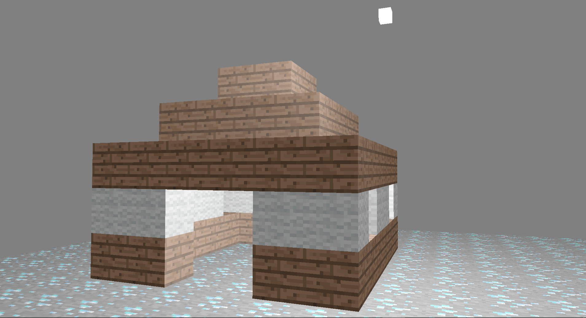
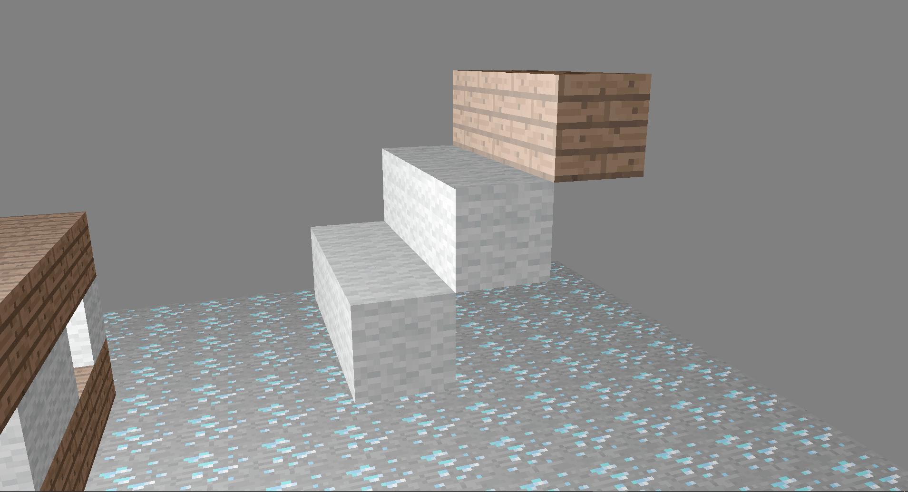

> 代码的编码格式为UTF-8，所以在Windows上查看可能会出现乱码。使用时建议改一下编码。

# 环境需求

1. `g++`编译器和 `make`工具，或能进行替代的编译器和工具链。
2. 相关的头文件和库文件，如 `glfw`、`glad`、`glm`等（已在工作区给出，并已经在 `makefile`里面设置好了相关库的链接，如无特殊需求无需更改）。

---

# 设计

仿照Minecraft，通过放置不同的方块来搭建一个场景。

1. 操作逻辑和纹理素材均来自于Minecraft。
2. 仿照fps游戏的逻辑，实现了摄像机在场景中的漫游。
3. 本来打算沿视线射线方向进行碰撞检测后放置方块的，但是出现了BUG且难以找出问题，所以就换成了在当前摄像机位置放置方块，也算是实现了基本需求。

---
# 运行

工作区目录的命令行中输入`make run`，或点击output文件夹下的run.bat。

---

# 测试

1. 给出了默认的方块数据，搭建了一座房子——按鼠标右键即可生成。

    

2. 可以在场景中添加方块，按下鼠标左键即可。

    

3. 按下esc退出，新增的方块也被保存在 `save.dat`中。

---

# 使用说明

1. 使用 `wasd`四个键可以在场景中移动摄像机。
2. 按下鼠标左键可以在当前摄像机位置处放置方块，但用于向下取整的原因，方块位置可能会有一些偏移。
3. 按下鼠标右键可以从存档中读取之前场景中方块的数据，并在当前场景中应用。
4. 按下 `esc`键退出程序，并将当前场景中的所有方块数据存入 `save.dat`中。

---

# 不足

1. 没有实现沿射线方向的碰撞检测
2. 场景的光照效果不好，一是没有设置好光源和材质的相关参数；二是使用的光照模型有待改进。
3. 导出的数据规范性有待提升，直接是一个方块的信息占一行。这样虽然读写都方便，但是可读性不强。最好使用键值对的方式，如 `.json`、`.xml`的文件格式来保存，或者存储到数据库中。
